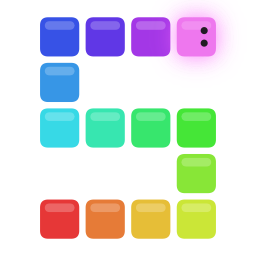
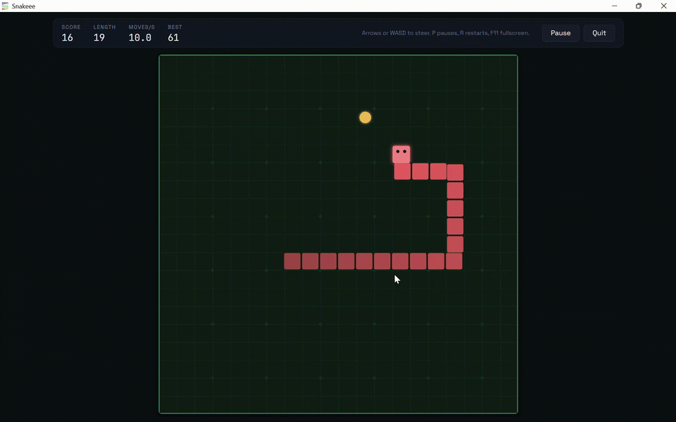

  

<h1 align="center">Snakeee</h1>

  LAN multiplayer snake. No account, no server, no internet connection.

  <a href="https://github.com/tomiwa-adesanya/snakeee/releases/latest">Download</a>
  &middot;
  <a href="ARCHITECTURE.md">How it is built</a>
  &middot;
  <a href="CONTRIBUTING.md">Contributing</a>

  

LAN multiplayer snake. One person hosts, reads out a short code, and everyone
else on the same network joins. The host writes the rules of the match. No
account, no server, no internet connection.

## What works today

- Single player: configurable arena, speed, edges and food, with personal bests
  kept per configuration and named setups you can save, in the colour you pick.
- Rooms: host on your local network and everyone else sees it in their room list
  without typing anything. Private rooms are not listed and use a short code
  instead. Either way you land in a shared lobby with a player list and ready
  flags.
- Shared matches: up to twelve snakes in one arena, simulated entirely by the
  host. The host sets the rules from the lobby and everyone sees the change.
- Fighting: running into a snake cuts it where you hit it rather than killing
  you, and the part that comes off is food on the floor that anyone can take. A
  feed across the top of the arena says who did what to whom. Lives, respawns, spawn protection, kills, a live leaderboard and five
  ways for a match to end. Join a match already in progress, and play another
  without leaving the room.
- Everything offline. No account, no server, no telemetry.

- Several arenas joined edge to edge, as a grid. Cross the right edge of one and
  you come out of the left edge of the next. Which arena somebody is in is
  public; where in it they are is not, so a layout is a game of hide and seek.
- Poisons that slow you, shrink you or reverse your controls, and pickups that
  give you a burst of speed, let you pass through a snake, or pull food toward
  you.
- Computer-controlled snakes, in three difficulty tiers with an aggression
  setting, in any room.
- Spectators, four themes, saved rule presets and a room code you choose
  yourself.

All forty-seven options live in one rule editor, with the ones that depend on
each other shown and hidden together.

Contributions are welcome, including ideas that are not on this list. There is no
fixed roadmap to follow: if you want a feature, propose it or build it.

## Download

Binaries for the current release are on the
[releases page](https://github.com/tomiwa-adesanya/snakeee/releases/latest).

| | |
|---|---|
| Windows, installer | `snakeee-v<version>-windows-x64-setup.exe` |
| Windows, no install | `snakeee-v<version>-windows-x64.exe` |
| Debian and Ubuntu | `snakeee_<version>_amd64.deb`, installed with `sudo apt install ./snakeee_<version>_amd64.deb` |
| Linux, no install | `snakeee-v<version>-linux-x64`, which needs `chmod +x` before the first run |

Everyone who wants to play needs one, on the same network. There is no separate
server to run.

The `.deb` is the easier of the two Linux downloads: it puts the game in the
applications menu and pulls in the webview packages listed below, which the
plain binary expects you to install yourself.

Neither binary is code signed, so Windows SmartScreen will warn on first run.
Choose More info, then Run anyway, or build it yourself from source below.

## Run from source

You need Python 3.10 or newer.

    pip install -r requirements.txt
    python main.py

That is the whole setup. Nuitka is a release concern only, and you never need
it to work on the game.

### Linux

The GTK WebKit backend needs system packages that pip cannot install:

    sudo apt-get install python3-gi gir1.2-webkit2-4.1 libcairo2 libgirepository1.0-dev

### Windows

The WebView2 Runtime is present by default on Windows 11 and on most Windows 10
installations. If the window fails to open, install it from Microsoft and try
again; the error dialog will say so.

### macOS

Nothing extra. The Cocoa WebKit backend is built into the system.

## Playing together

One person hosts and reads out a code. Everything stays on the local network.

1. Both machines set a username and colour under Settings. Names and colours have
   to be unique within a room.
2. The host opens Play, chooses Multiplayer, then Open a room. A five-character
   code appears.
3. Everyone else chooses Multiplayer, Enter a code, and types it. Case and dashes
   do not matter, and the letters I, L, O and U never appear in a code, so there
   is nothing to confuse with 1 and 0.

The code carries the host's address, so nothing is sent anywhere to resolve it.
If a code does not work, the lobby also lists the raw addresses; that usually
means the two machines are on different networks.

On Windows the first host triggers a firewall prompt. Allow the game on private
networks. Blocking it leaves single player working and nobody able to join.

A room refuses a join for one of five specific reasons, and says which: the room
is full, the name is taken, the colour is taken, the match has started, or the two
copies of the game speak different protocol versions.

### Watching

Tick "Watch without playing" before joining, or press Watch on a room in the
list. A spectator takes no seat, so a room that is full or already playing can
still be watched, and nothing about the match waits on them.

A spectator follows one player at a time and sees what that player sees. On a
layout with more than one arena that matters: watching shows you one arena, the
same as playing does, so a second copy of the game running beside you is not a
way to see where everybody is. Pick a different player from the strip above the
board to follow them instead.

The host can turn spectators off in the room rules, and can remove one from the
lobby.

## Run without a window

Useful for testing the server on its own, or on a machine with no display:

    python main.py --no-window

Then open `http://127.0.0.1:45880/` in a browser. The UI server binds to
loopback only and is never what other players connect to.

## Development

[ARCHITECTURE.md](ARCHITECTURE.md) is the tour: what every directory holds, what
each script in `tools/` checks, and the decisions that are load bearing. Read it
before changing anything in `utils/net/` or `utils/game/match.py`.

    pip install -e ".[dev]"
    git config core.hooksPath tools/hooks
    pytest -q
    ruff check .
    python tools/check_ascii.py

## Building a binary

    pip install nuitka
    python build.py

The script looks at the machine it is running on and builds for that: a single
`.exe` with no console window on Windows, a single executable on Linux.

The binary lands in the project root. On Linux the script also offers to
package it as a `.deb`, which needs `dpkg-deb`:

    sudo apt install dpkg-dev

The package installs the binary to `/usr/local/bin`, adds a desktop entry with
the icon, and declares the webview packages as dependencies so apt pulls them
in. It lands in `dist/`.

There is no cross compilation. Nuitka uses the host's C compiler and the host's
libraries, so a Windows binary comes from Windows and a Linux binary comes from
Linux. On Linux the build also needs `patchelf`:

    sudo apt install patchelf build-essential

### The Windows setup

`installer/windows.iss` is an [Inno Setup](https://jrsoftware.org/isinfo.php)
script that wraps the built `.exe` into an installer. Build first, then:

    iscc installer\windows.iss

Every path in it is relative, so it compiles from a clone with nothing to edit.
The version comes from `installer/version.iss`, which is not generated: bump it
alongside `APP_VERSION` in `app.py` when you release.

## Two rules the pre-commit hook enforces

1. **Every text file is pure 7-bit ASCII.** No em dashes, no curly quotes, no
   ellipsis characters, no arrows, no emoji, no accented characters, anywhere,
   including comments and commit messages.
2. **The game name appears only in `utils/branding.py`.** Not in any other `.py`,
   `.js`, `.css` or `.html` file. The frontend reads it from `/api/branding`.

`python tools/check_ascii.py` runs both, and is what the pre-commit hook calls.
GitHub Actions runs it again on every push and pull request, along with the
tests and ruff, so a contributor who never installed the hook is still caught.
Install it anyway: finding out locally is faster than finding out from a red
pull request.

## Renaming

The name lives in one file. To change it:

1. Edit the constants in `utils/branding.py`.
2. Update the Markdown files and the window icon.
3. Leave the discovery magic and the installer `AppId` alone. Both are
   deliberately independent of the name so that a renamed build still finds
   older builds on the LAN and still upgrades in place on Windows.

## What it collects

Nothing. No accounts, no analytics, no crash reporting, no outbound network
calls of any kind. The only traffic the game generates stays on your local
network, and it only exists while you are hosting or joined to a room. Logs are
written to a file on your own machine and are never sent anywhere:

| OS | Location |
|---|---|
| Windows | `%APPDATA%\Snakeee\logs\app.log` |
| macOS | `~/Library/Application Support/Snakeee/logs/app.log` |
| Linux | `~/.local/share/snakeee/logs/app.log` |

## License

MIT. See `LICENSE`. Bundled fonts are OFL 1.1; see `THIRD_PARTY_LICENSES.md`.
